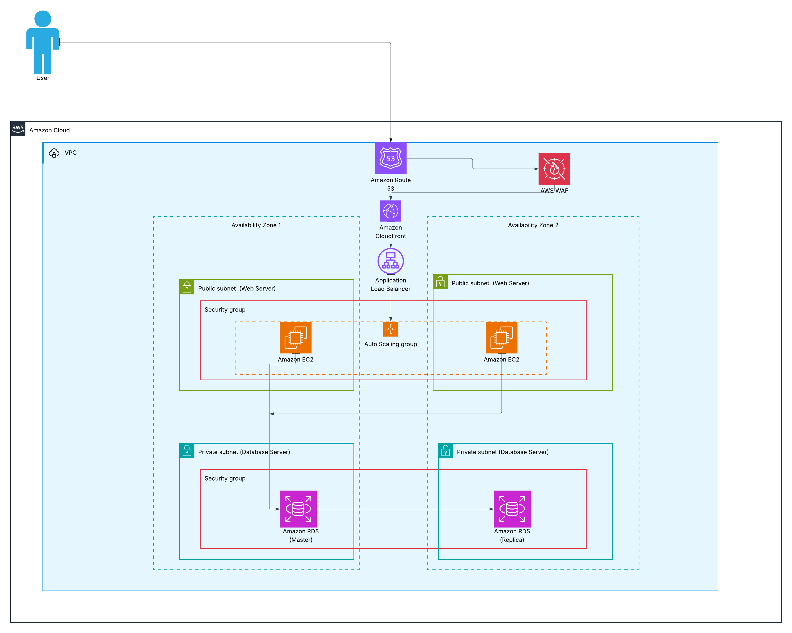

# AWS Well-Architected & Cloud Adoption Framework Assessment

**Lab Title:** Design and Evaluate an AWS Solution Using the Well-Architected and Cloud Adoption Frameworks  

The AWS Well-Architected Framework currently includes **six pillars**: Operational Excellence, Security, Reliability, Performance Efficiency, Cost Optimization, and **Sustainability** (emphasizing efficient resource use to minimize environmental impact).

## Task 1 – Review the Existing Architecture

### 1. Components of the workload.

| AWS Resource              | Details                                                                 |
|---------------------------|-------------------------------------------------------------------------|
| Amazon RDS                | Single-AZ MySQL or PostgreSQL instance in a private subnet              |
| EC2 instances             | 1–2 t3.medium or m5.large instances running the web/frontend/application tier |
| Security Groups           | Web SG: ports 80, 443, 22 open from 0.0.0.0/0                           |
| EBS volumes               | Root and data volumes attached to EC2                                   |
| RDS automated backups     | Enabled with default 7-day retention                                    |
| Internet Gateway          | Attached to the VPC; EC2 instances directly reachable from internet     |
| VPC                       | Single VPC with public and private subnets                              |
| Elastic IP / Public DNS   | Directly pointing to EC2 instance (no load balancer)                    |

### 2. Potential risks or weaknesses
- **Single-AZ deployment** — EC2 and RDS in one AZ; Availability Zone failure causes full outage.
- **No load balancer** — Direct traffic to 1–2 EC2 instances; single point of failure, no health checks.
- **No Auto Scaling** — Cannot handle traffic spikes or scale down to save costs.
- **Excessively open security groups** — Port 22 (SSH) and 80/443 open to 0.0.0.0/0 → high risk of compromise.
- **Direct SSH key access** — Hard to audit/manage; violates best practices.
- **Single-AZ RDS** — No automatic failover; potential data loss on failure.
- **Weak backup strategy** — Only default 7-day RDS backups; no manual snapshots or cross-region copies.
- **No web application firewall** — Vulnerable to SQL injection, XSS, etc.
- **No CDN** — Slow global load times; all traffic hits EC2 directly.
- **Limited monitoring** — Basic CloudWatch only; issues often detected by users.
- **Always-on fixed instances** — Paying for idle capacity 24/7 (also increases unnecessary energy consumption).

## Task 2 – Well-Architected Framework Evaluation

| Pillar                  | Observation (Strength)                          | Improvement Needed                          | Recommendation                                      | Supporting AWS Service                  |
|-------------------------|-------------------------------------------------|---------------------------------------------|-----------------------------------------------------|-----------------------------------------|
| **Operational Excellence** | Infrastructure in cloud enables automation potential | Lacks centralized monitoring & IaC          | Implement observability, IaC, and automated ops     | CloudWatch, CloudTrail, AWS Config, CloudFormation |
| **Security**            | Moved away from on-prem unsecured network       | Security groups too open + unencrypted data | Least-privilege rules, encryption, no public SSH    | VPC Security Groups, KMS, IAM, ACM, Secrets Manager, AWS WAF |
| **Reliability**         | Easy to introduce backups in AWS                | Single-AZ risks full downtime               | Multi-AZ deployment + automatic failover            | RDS Multi-AZ, Auto Scaling Group, ALB   |
| **Performance Efficiency** | Scalable compute available on-demand          | Manual scaling leads to overload/underuse   | Elastic scaling + caching/CDN                       | Auto Scaling Group, CloudFront, ElastiCache |
| **Cost Optimization**   | Pay-as-you-go eliminates upfront hardware costs | Over-provisioned always-on resources        | Right-size + scale to demand + committed discounts  | Auto Scaling, Compute Savings Plans, Trusted Advisor |
| **Sustainability**      | Cloud infrastructure allows for efficient hardware choices | Always-on fixed instances waste energy; no demand alignment | Maximize utilization, scale dynamically, prefer efficient services/hardware | Auto Scaling Group, Graviton instances, Managed Services (RDS, ALB), AWS Compute Optimizer |

## Task 3 – Apply the AWS Cloud Adoption Framework (CAF)

### Business Perspective
The organization is motivated to adopt AWS for better scalability, reduced infrastructure costs, and faster delivery. However, maturity remains partial — no formal cloud value roadmap, TCO/ROI model, or defined KPIs (e.g., uptime gains, faster time-to-market, customer satisfaction). Business stakeholders recognize cloud benefits but lack quantified justification or executive alignment.  
**Key actions/enablers:** Establish strong executive sponsorship, develop a business case with AWS TCO/ROI tools, define success metrics, and align cloud goals with revenue growth and competitiveness. This ensures the migration delivers strategic value beyond IT cost savings.

### People Perspective
The IT team has strong on-premises experience but limited AWS/cloud-native skills (e.g., VPC, managed services, IaC). Roles are still traditional; change management is weak.  
**Key actions/enablers:** Invest in upskilling via AWS Skill Builder, certifications, workshops, and labs. Establish a Cloud Center of Excellence (CCoE), mentorship, and agile/DevOps practices. Redefine roles for shared responsibility. Effective training and communication will reduce resistance and enable the team to operate the new architecture confidently.

### Governance Perspective
No cloud-specific policies exist (tagging, budgeting, compliance), risking uncontrolled costs and security gaps.  
**Key actions/enablers:** Define mandatory tagging, budget alerts, SCPs via AWS Organizations, and lifecycle policies. Use AWS Control Tower for landing zone guardrails and Trusted Advisor for best practices. Involve finance/procurement in variable pricing education. Mandate periodic Well-Architected reviews. Strong governance will support secure, compliant scaling post-migration.

### Platform Perspective
Current setup is functional but not highly available, automated, or cloud-native (single-AZ, manual ops).  
**Key actions/enablers:** Adopt Multi-AZ, load balancing, Auto Scaling, and IaC (CloudFormation). Standardize VPC patterns (public/private subnets, NAT), use managed services (RDS Multi-AZ, ALB), and implement CI/CD pipelines. This creates a repeatable, resilient platform foundation for the improved architecture.

### Security Perspective
Security maturity is low — still using perimeter-based thinking instead of cloud-native controls. Open ports and manual SSH persist from on-prem habits.  
**Key actions/enablers:** Embrace Shared Responsibility Model. Enforce least-privilege IAM roles, encrypt data (KMS/ACM), use private subnets, Security Groups/NACLs, and AWS WAF on ALB. Enable CloudTrail, GuardDuty, Security Hub for visibility. Define compliance early (e.g., GDPR/PCI). This shifts to proactive, secure-by-design posture.

### Operations Perspective
Operations rely on manual maintenance; monitoring is reactive.  
**Key actions/enablers:** Move to proactive CloudWatch metrics/alarms/dashboards, automated patching (Systems Manager), runbooks, and incident response plans. Define RPO/RTO and test DR. Automate deployments and reviews. This reduces downtime, improves reliability, and aligns with Operational Excellence.

## Task 4 – Design an Improved Architecture

### Improved Architecture Diagram
  

### Description of the Revised Architecture
The new design is a secure, highly available, scalable two-tier web application in a VPC:
- **Amazon Route 53** for DNS resolution.
- **Amazon CloudFront** (CDN) for global low-latency delivery and caching of static content.
- **AWS WAF** attached to CloudFront/ALB for protection against common web attacks.
- **Application Load Balancer (ALB)** in public subnets distributing traffic across AZs.
- **Frontend tier**: EC2 instances in **Auto Scaling Group (ASG)** spanning multiple Availability Zones (public subnets), protected by security groups allowing traffic only from ALB.
- **Backend database**: **Amazon RDS Multi-AZ** (master + synchronous replica) in private subnets, accessible only from the web tier (e.g., port 3306/5432).
- Public subnets route to Internet Gateway; private subnets use NAT Gateway for outbound (patches/updates).
- Security groups enforce least-privilege access.

This covers AWS reference architecture for two-tier applications and also addresses all of Task 1 weaknesses.

### How the new design aligns with the six WAF pillars
- **Operational Excellence** — IaC (CloudFormation) for repeatable deployment; Session Manager (no open port 22); centralized CloudWatch monitoring/alarms.
- **Security** — Private subnets for RDS; least-privilege security groups (ALB → EC2 only, EC2 → RDS only); ACM TLS; AWS WAF for threat protection; no public SSH.
- **Reliability** — Multi-AZ across Route 53, CloudFront, ALB, ASG, and RDS (automatic failover); health checks replace unhealthy instances.
- **Performance Efficiency** — CloudFront CDN reduces latency; ALB intelligent routing; ASG elastic scaling to match demand.
- **Cost Optimization** — ASG scales down during low traffic (can reach min 1 or 0); Savings Plans; pay only for used resources.
- **Sustainability** — Dynamic scaling minimizes idle compute/energy; managed services (RDS, ALB, CloudFront) reduce operational overhead; potential Graviton instances for lower carbon footprint; right-sizing aligns resources to actual demand.

The design fully resolves the risks identified in Task 1  and supports CAF perspectives through managed services.

## Brief Reflection
Working on this leab made me gain hands on practice on the concepts of WAF and CAF that I learnt about during my prep for  my Cloud Practitioner certification. I now clearly see how the **six Well-Architected pillars** especially Sustainability apply to real workloads beyond just the theory. The biggest insight was that lift-and-shift alone is insufficient; high availability, least-privilege security, elastic scaling, and energy-efficient design must be baked in from the start. The CAF analysis also showed me that it just doesn't have to be only about the Technical side, but also organizational readiness (people, governance, business alignment) is equally critical. Creating the diagram helped me think like a cloud architect(which I am considering on moving into), balancing trade-offs and justifying choices. I now appreciate why AWS lays more emphasis on building correctly the very first time. Thank you for the opportunity!

**References**  
- AWS Well-Architected Framework: https://docs.aws.amazon.com/wellarchitected/latest/framework/welcome.html  
- AWS Cloud Adoption Framework  

